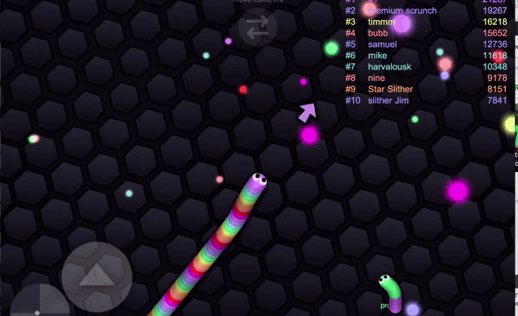

# 🐍 Network Slither – Unity Multiplayer Project

A real-time **multiplayer Slither.io–style game** built with **Unity**, featuring smooth player movement, snake growth, food collection, and real-time network synchronization.



---

## 🎮 Features

### Core Gameplay

- Real-time multiplayer snakes
- Smooth directional movement
- Food spawning & consumption
- Snake growth mechanics
- Collision detection
- Death & respawn logic

### 🌐 Networking

- Client–server architecture
- Real-time transform synchronization
- Interpolated movement for smooth visuals
- Player join / leave handling
- Basic server-authoritative logic

### 🖥️ UI & UX

- Player nickname input
- Minimal HUD (score / snake length)
- Camera follow system
- Demo-friendly visuals

---

## 📸 Screenshots

> 📌 **Tip:** Create a `Screenshots/` folder in your repo and export images from Unity at **1920×1080** for best quality.

### 🎮 Gameplay

- Top-down arena view
- Multiple snakes in the same map
- Food pellets scattered across the arena

### 🌐 Multiplayer Sync

- Real-time synced player movement
- Smooth interpolation between network updates
- Dynamic join & leave

### 🖥️ HUD / UI

- Player name display
- Current length / score
- Minimal and clean UI

### 🧪 Development / Editor View

- Unity Game View
- Scene & object layout
- Debugging and testing mode

---

## 🧠 Tech Stack

| Component    | Technology                    |
| ------------ | ----------------------------- |
| Game Engine  | Unity 2021+ (LTS recommended) |
| Language     | C#                            |
| Networking   | Photon / Mirror / FishNet     |
| Platform     | PC / WebGL (optional)         |
| Architecture | Component-based               |

---

## 🚀 Getting Started

### Prerequisites

- Unity Hub installed
- Unity Editor **2021 LTS** or newer
- Internet connection for multiplayer testing

### Setup

```bash
git clone https://github.com/xbabas55/network-slither-unity.git
```

1. Open **Unity Hub**
2. Add and open the project
3. Open the scene: `Assets/Scenes/Main.unity`
4. Press **Play**
5. Run multiple builds or editor instances to test multiplayer

---

## ⚙️ Configuration

### Player Speed

```csharp
[SerializeField] private float moveSpeed = 5f;
```

### Initial Snake Length

```csharp
[SerializeField] private int startLength = 5;
```

### Max Players

Configured via the selected networking solution (Photon / Mirror / FishNet).

---

## 🧪 Demo Limitations

- No persistent user accounts
- No matchmaking or ranking
- No anti-cheat protection
- Demo-grade assets only
- Not production-ready

---

## 📈 Planned Improvements

- Matchmaking & lobby system
- Leaderboard
- Mobile touch controls
- Snake skin customization
- Server-side validation
- Spectator mode

---

## 📄 License

This project is provided for **educational and demonstration purposes**. You are free to modify and extend it for **personal or portfolio use**.

---

## 👤 Author

**Kaito Jhon**

---

⭐ If you find this project useful, consider starring the repository!

